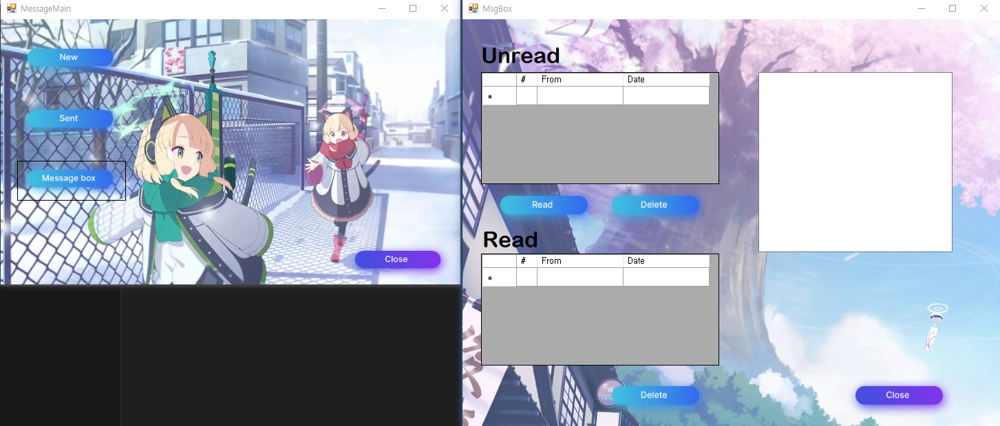

# 메신저 프로그램

## 프로젝트 개요
이 프로젝트는 Cpp/CLI와 소켓통신을 이용한 간단한 메신저 프로그램입니다.
회원과 채팅기록을 관리하기 위하여 MySQL를 사용하였으며, 클라이언트와 서버를 만들어 연동하게 하였습니다.

## 주요 기능

- 기능 1: 회원가입 및 아이디 찾기

  
  

- 기능 2: 채팅방접속
  
  

- 기능 3: 친구추가 및 관리
  

- 기능 4: 쪽지 보내기
  

## Database 구조
  

## 시연영상
[유튜브 링크](https://youtu.be/HBpXbJ_PWr0?si=lU0wJy6quX_jf3sn)